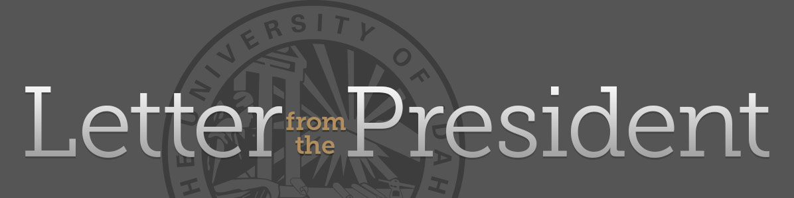

# About {{ site.title }}

"The Friday Letter is U of I’s long-running, weekly message straight from the president to members of the Vandal family. Each week during the academic year, and with breaks for holidays, the president offers an update on Vandal teaching and learning, research and scholarship, and notable initiatives and priorities. Alumni and friends are welcome to join students, faculty and staff in receiving the newsletter."

To ensure continued access to the unique content of university communications, University of Idaho Library captures items in their original web context on an annual basis. This archive currently contains more than 80 items ranging from 2015 to 2017.

Please note, to preserve basic functionality outside of the original content management system, all JavaScript and external dependencies found in the original web pages and email messages have been removed.
Some features have been disabled and links may be broken or out of date.

For current news, please visit [Office of the President Communications](http://www.uidaho.edu/president/communications).
